# Darna — State of the Project

> Multi-tenant restaurant management platform. Last reviewed: **2026-07-20**, against migrations `0001`–`0017` and the current `main` working tree.

**Stack:** Next.js 16.2.10 (App Router, Turbopack) · React 19 · Supabase (Postgres 17 + Auth + Storage + Realtime) · Tailwind v4 + shadcn/ui (radix-nova) · TanStack Query · Zustand · Recharts · Zod · framer-motion · web-vitals

---

## 1. Architectural Overview

### 1.1 One monolith, three surfaces

This is **not** a microservices system — deliberately. It is a single Next.js app + a single Supabase project, split into three route trees that share one database with row-level isolation:

| Surface | Routes | Audience | Auth boundary |
|---|---|---|---|
| **Super Admin ("Darna")** | `/admin/*`, `/api/admin/*` | Platform operator | `platform_admins` membership (`requireSuperAdmin`), service-role DB access |
| **Owner Dashboard** | `/dashboard/*`, `/api/dashboard/*` | Restaurant staff (4 roles) | `profiles` row + RLS + role guards (`requireRole`) |
| **Public storefronts** | `/[slug]/*` (menu, checkout, reservation, about, contact) | Customers | Anonymous; anon-key reads under public RLS policies, writes via server-side service role scoped by slug |

### 1.2 Routing & RBAC — a correction on "Edge middleware"

There is **no `middleware.ts` and no Edge runtime** in this project, and there must not be one: Next 16 renamed the middleware convention to **`proxy`** (`src/proxy.ts`, `nodejs` runtime — a `middleware.ts` file would be silently ignored). RBAC is enforced in **four layers**, server-first:

```
Request
  │
  ▼ 1. src/proxy.ts (Next 16 proxy, nodejs runtime)
  │    · Supabase session cookie refresh
  │    · Unauthenticated → /login?next=…
  │    · Coarse gate: /dashboard/{settings,team,analytics} owner-only
  │    · Role-aware landing after login (defaultRouteFor)
  │    · Forwards x-pathname header to server components
  ▼ 2. src/app/dashboard/layout.tsx (server layout — AUTHORITATIVE)
  │    · canAccessRoute(role, pathname) → redirect(defaultRouteFor(role))
  │    · must_change_password + suspended-tenant takeovers
  ▼ 3. API route guards (src/lib/dashboard.ts)
  │    · requireRole([...]) / requireOwner() / requireSession() per route
  │    · assertFeature(ctx, key) for plan-gated features
  ▼ 4. Postgres RLS (last line — holds even if all app code is bypassed)
       · my_restaurant_id() / my_role() / my_role_can_manage() SECURITY DEFINER helpers
```

The single source of truth for the access matrix is **`src/lib/permissions.ts`** (pure, importable by proxy, server, and client): `ROUTE_ACCESS`, `WRITE_ACCESS`, `canAccessRoute()`, `canWrite()`, `defaultRouteFor()`. Sidebar filtering (`app-sidebar.tsx`) consumes the same matrix but is cosmetic only.

**Role model (migration `0008`):** `profiles.role ∈ {owner, manager, serveur, cuisine}` — `owner` is the tenant Admin and the historical RLS write-authority; `manager/serveur/cuisine` split the old `staff` tier. `profiles.active` enables soft-deactivation (checked in `getSessionContext`, so a disabled member with a live cookie is bounced immediately).

| Route | owner | manager | serveur | cuisine |
|---|:-:|:-:|:-:|:-:|
| `/dashboard` (Aperçu) | ✓ | ✓ | — | — |
| `/dashboard/orders` | ✓ | ✓ | ✓ | ✓ |
| `/dashboard/reservations` | ✓ | ✓ | ✓ | — |
| `/dashboard/menu` | ✓ | ✓ | RO | RO |
| `/dashboard/tables` | ✓ | ✓ | ✓ | — |
| `/dashboard/inventory` (incl. `/variances`) | ✓ | ✓ | — | RO |
| `/dashboard/kds` | ✓ | ✓ | ✓ | ✓ |
| `/dashboard/customers` | ✓ | ✓ | — | — |
| `/dashboard/analytics` / `settings` / `team` | ✓ | — | — | — |

### 1.3 State management strategy

Deliberately **server-first**; there is no global client auth store, and that is a feature, not a gap:

- **Server state:** TanStack Query per surface (`["staff"]`, `["admin-analytics"]`, `["dashboard-inventory"]`, `["kds-tickets"]`, `["table-turnover"]`, `["admin-web-vitals"]`, …), fetched from API routes that re-check auth on every call.
- **Session/role:** resolved server-side per request (`getSessionContext()`, profile → restaurant+features in parallel), passed down as props. A client-side role store would be spoofable decoration — the pattern here means UI role state can never disagree with what the server enforces.
- **Client state:** one Zustand store — the public-site **cart** (`src/store/cart.ts`, `persist`-ed, keyed by restaurant slug + optional `?table=` QR param for dine-in). Everything else is local `useState`.
- **Real user monitoring:** `WebVitalsReporter` (root layout) reports CLS/LCP/INP/FCP/TTFB via `navigator.sendBeacon` to `/api/vitals`, stored in `web_vitals` (`0017`) and surfaced as P75-by-surface on the admin overview.
- **Live updates:** Supabase Realtime, used for the first time as of `0013`/`0014`/`0015` — `orders`, `kds_tickets`, and `table_sessions` are in the `supabase_realtime` publication. `KdsView` and `TableTurnoverPanel` subscribe directly (`postgres_changes`) instead of polling.
- **Public data caching:** `unstable_cache` with `revalidate: 60` + tag `"menu"` on all public reads (`getPublicMenu`, `getPublicFeatures`, `getPublicTheme`) — `getPublicMenu` also calls `get_available_menu` (auto-86: recipe-linked items with insufficient stock render greyed out, same as a manual 86). Admin theme publishes and analytics-affecting mutations call `revalidateTag(tag, "max")`.

### 1.4 Tenant isolation model

Every tenant table carries `restaurant_id` and RLS. Three access tiers:

1. **Public read** (`using (true)`): `restaurants`, `categories`, `items`, `promotions` — the storefront's menu data, read with the anon key.
2. **Tenant-scoped** (`restaurant_id = my_restaurant_id()`): orders, reservations, tables, table_sessions, inventory, recipes, kds_tickets, customers — with role predicates on writes (`my_role() = 'owner'` or `my_role_can_manage()` for manager-writable tables since `0008`).
3. **Service-role only** (RLS on, zero policies): `restaurant_theme`, `platform_admins`, `audit_logs`, `web_vitals` — reachable only through `createAdminClient()` behind `requireSuperAdmin()` (or, for `web_vitals` writes, the public `/api/vitals` insert-only route).

Public writes (customer order/reservation) go through server routes that resolve the restaurant from the slug server-side and insert with the service role — the browser never chooses a `restaurant_id`. `/api/orders` and `/api/reservations` are rate-limited per IP + per tenant (`src/lib/rate-limit.ts`, `0011_rate_limits.sql`).

### 1.5 Core ERD

```mermaid
erDiagram
    restaurants ||--o{ restaurants : "parent_restaurant_id (franchise)"
    restaurants ||--o{ profiles : "staff"
    restaurants ||--|| subscriptions : "billing"
    restaurants ||--|| restaurant_theme : "bespoke site"
    restaurants ||--o{ restaurant_features : "plan overrides"
    restaurants ||--o{ categories : ""
    restaurants ||--o{ items : ""
    restaurants ||--o{ promotions : "smart menu combos"
    restaurants ||--o{ orders : ""
    restaurants ||--o{ reservations : ""
    restaurants ||--o{ customers : ""
    restaurants ||--o{ tables : "floor plan"
    restaurants ||--o{ table_sessions : "occupancy (0015)"
    restaurants ||--o{ inventory_categories : ""
    restaurants ||--o{ inventory_items : ""
    restaurants ||--o{ suppliers : ""
    restaurants ||--o{ deliveries : ""
    restaurants ||--o{ recipes : "menu costing (0013)"
    restaurants ||--o{ inventory_variances : "stock shortfalls (0013)"
    restaurants ||--o{ stations : "kitchen zones (0014)"
    restaurants ||--o{ kds_tickets : "fan-out (0014)"
    categories ||--o{ items : ""
    items ||--o{ recipes : "ingredients"
    items }o--o| stations : "routes to"
    inventory_categories ||--o{ inventory_items : ""
    inventory_items ||--o{ recipes : "consumed by"
    suppliers ||--o{ deliveries : ""
    tables ||--o{ table_sessions : ""
    orders ||--o{ kds_tickets : "one per station"
    orders ||--o| table_sessions : "seats/vacates"
    customers |o--o{ orders : "optional link"
    auth_users ||--|| profiles : "id FK"
    auth_users |o--o| platform_admins : "super admin"
    platform_admins ||--o{ audit_logs : "admin_id"

    restaurants {
        uuid id PK
        text slug UK
        text plan "free|pro|enterprise"
        text status "active|trial|suspended|expired"
        uuid parent_restaurant_id FK "nullable, 0009 — no write UI yet"
    }
    profiles {
        uuid id PK "= auth.users.id"
        uuid restaurant_id FK
        text role "owner|manager|serveur|cuisine (0008)"
        bool active "soft-disable (0008)"
        bool must_change_password
    }
    subscriptions {
        uuid restaurant_id FK "unique"
        text plan_tier
        text status "active|trialing|past_due|canceled"
        text billing_cycle "monthly|yearly"
        numeric price_mad
        timestamptz trial_ends_at
        timestamptz canceled_at "0010 — churn math source of truth"
    }
    items {
        uuid category_id FK
        uuid station_id FK "0014, nullable"
        numeric base_price
        bool in_stock
        bool is_smart_menu_eligible "0007"
        jsonb customization_groups
    }
    recipes {
        uuid menu_item_id FK
        uuid inventory_item_id FK
        numeric quantity
        text unit
    }
    orders {
        uuid restaurant_id FK
        text type "dine_in|delivery"
        jsonb items "denormalized lines: item_id/quantity/unit_price/options"
        text status "new|preparing|done"
        text table_number "nullable"
    }
    table_sessions {
        uuid table_id FK
        uuid order_id FK "nullable"
        timestamptz seated_at
        timestamptz vacated_at "nullable"
        text status "active|completed"
    }
    kds_tickets {
        uuid order_id FK
        uuid station_id FK "nullable = catch-all"
        jsonb lines "subset of order.items for this station"
        text status "pending|bumped"
    }
    inventory_variances {
        uuid inventory_item_id FK
        uuid order_id FK "nullable"
        numeric expected_deduction
        numeric available_stock
        text reason "stock_went_negative"
    }
    restaurant_features {
        uuid restaurant_id FK
        text feature_key "10 keys, CHECK-constrained"
        bool enabled
    }
    web_vitals {
        text pathname
        text slug "nullable — storefront pages only"
        text metric_name "CLS|LCP|INP|FCP|TTFB"
        numeric value
        text rating "good|needs-improvement|poor"
    }
```



*(`orders.items` is denormalized JSONB by design — an order is an immutable receipt; menu edits must not rewrite history. Two DB triggers now fire on every order insert: `auto_deduct_inventory` (stock, clamped at 0, never blocks the order) and `fan_order_to_kds` (kitchen tickets); a third fires on `dine_in` inserts (`auto_start_table_session`) and a fourth on status→`done` updates (`auto_vacate_table_session`).)*

---

## 2. Current Progress — What We Have Achieved

### Super Admin ("Darna") — `/admin`
- ✅ **Overview**: financial KPIs with delta pills (MRR growth, ARPU, churn rate from `canceled_at`, pending revenue), platform-health row (real DAU/MAU/stickiness, cached — no more per-request Auth-API N+1), revenue area chart backed by a Postgres rollup RPC (`get_order_aggregates`, `0016` — replaced a raw up-to-20k-row `orders` fetch), plan-distribution donut, 8-week Acquisition vs Désabonnement bar chart, recent-signups table, at-risk table, collapsible franchise tree (`parent_restaurant_id`) with honest empty state, and a **Core Web Vitals P75 panel** (per-surface: storefront/dashboard/admin, last 7 days, `get_web_vitals_p75` RPC, `0017`).
- ✅ **Restaurants**: search + plan/status/city filters, pagination, platform-wide summary strip, per-row monthly revenue/orders/last-owner-login, create dialog, detail panel, quick suspend/reactivate, per-restaurant site builder (theme draft/publish with asset upload — uploads now capped at 1MB WebP, client-compressed with an iterative quality-reduction loop).
- ✅ **Subscriptions**: summary strip, status filter chips, renewal countdown, full edit dialog + quick actions — deliberately unpaginated by design (bulk "select all restaurants" flow needs the full set; revisit past ~200 tenants).
- ✅ **Permissions**: bulk feature toggles with tri-state staging, resolved active-features column, audit-logged bulk upsert — same deliberate no-pagination tradeoff as Subscriptions.
- ✅ **Audit log**: every mutating `/api/admin/*` route writes `audit_logs` via `logAdminAction`.
- ✅ Plan-driven **feature flags** (10 keys, incl. `recipes`/`kds` added in `0013`/`0014`) with per-restaurant overrides; trial-expiry cron (`0004`) auto-downgrades.

### Owner Dashboard — `/dashboard`
- ✅ **4-role RBAC** end-to-end — matrix-driven sidebar, per-page gates, `requireRole` API guards, RLS extension, role-aware login landing.
- ✅ **Team (Équipe)**: datatable, search + role filter, kebab actions, invite dialog, self-protection (can't touch yourself or an owner).
- ✅ **Menu manager**: categories, items, customization groups, **cost/margin columns and a recipe editor** when the `recipes` feature is on (ingredient picker, live cost preview, feeds `menu_item_costs` — `0013`).
- ✅ **Recipe costing & inventory variances**: menu-item ↔ ingredient links; every order auto-deducts stock (clamped at 0, never blocks checkout) and logs a variance row when stock would've gone negative; a dedicated `/dashboard/inventory/variances` page lists them. Auto-86: the public menu greys out recipe-linked items whose ingredients are short, without hiding them.
- ✅ **Cuisine (KDS)**: full-screen live ticket board (`/dashboard/kds`), station-filtered, tap-to-bump, realtime-updated. `PosView` now places **real** staff-created orders (`POST /api/dashboard/orders`) that fan out to the kitchen through the same trigger as online orders — the dine-in gap flagged in the previous review is closed.
- ✅ **Tables & Plan**: floor-plan drag editor, QR-code generator, and — new — a **Table Turnover panel**: live "occupied now" chips with elapsed time (flagged past 90 min), plus today's/7-day service counts and average duration, realtime-subscribed to `table_sessions` (`0015`).
- ✅ **Inventory**, **Orders**, **Reservations**, **Customers** (CSV export), **Analytics**, **Overview**, **Settings**.
- ✅ Suspended-tenant takeover screen; forced password-change takeover; feature-locked placeholders per plan.

### Public storefronts — `/[slug]`
- ✅ Bespoke-theme rendering (colors, font pairs, hero images, section toggles, custom copy) with draft/preview/publish.
- ✅ Menu with category pills, dish cards, customization bottom-sheet, "Nos formules" (Menu Smart combos), **auto-86 on recipe-linked items**.
- ✅ Cart (Zustand persist, QR `?table=` dine-in context) → checkout → order POST → **triggers stock deduction, kitchen ticket, and table-session start automatically**; reservation form; about/contact.
- ✅ **Performance pass (Phase 7)**: every `` (19, not the 9 an early pass miscounted) converted to `next/image`; the homepage's default hero fallback shrank from a 1.6MB JPEG + 6.6MB PNG to two compressed WebP files; dead `framer-motion` imports removed from the hero (zero JSX usage, pure bundle weight); below-the-fold sections (`ValuesSection`/`TestimonialsSection`) and Recharts-heavy admin/dashboard views are dynamically imported; Lighthouse CI + RUM wired (real score capture pending a runner with system Chrome — this sandbox has none).

### Data & tooling
- ✅ **17 SQL migrations**, all applied to the live instance via the hosted `pg` pooler (no local Supabase stack). `0010`–`0012` closed out Phase 0–2 (churn integrity, rate limits, indexes); `0013`–`0015` are Phase 6.1–6.3 (recipes, KDS, table sessions); `0016`–`0017` are Phase 7 (order-aggregate rollup, web vitals) — **Phase 6.4 (labor) now starts at `0018`**, not the `0016` originally reserved for it, since Phase 7 landed in between.
- ✅ Secret hygiene: the previously git-tracked `spread_tables.mjs`/`check-db.js`/`test-profile.js`/`check_tables.mjs` (one of which embedded a live `service_role` JWT) are gone from HEAD; a husky pre-commit hook blocks staged JWT-shaped strings; `.github/workflows/secret-scan.yml` runs gitleaks in CI.
- ✅ **Automated tests**: 77 Vitest unit tests (`permissions.ts`, `features.ts`, `analytics-math.ts` — MRR/churn/ARPU extracted to pure functions specifically to be testable) + a Playwright RBAC matrix (`e2e/rbac.spec.ts`, one login per role, gated on a `BASE_URL` secret so it doesn't need a local Supabase stack). CI (`ci.yml`) runs typecheck/lint/test unconditionally, e2e and Lighthouse conditionally on their respective secrets being configured.
- ✅ Seeders: Ô rendez-vous full menu, themed inventory, idempotent team seeder, demo platform data (5 restaurants, orders, subscriptions).
- ✅ Mockup HTML bundles (8 files, up to 430KB) moved out of `src/` into `design-mockups/` at the repo root.

---

## 3. Database & State Analysis

### 3.1 Indexes — closed out

The gaps flagged in the previous review (`profiles.restaurant_id`, `orders.created_at`, a partial open-orders index, `subscriptions(status, canceled_at)`, a partial pending-reservations index) all shipped in `0012_indexes.sql` and are live. Nothing outstanding here.

### 3.2 Data-model gaps — what's left

- **Franchise tree has no write path.** `parent_restaurant_id` (since `0009`) renders read-only in the admin overview's tree — there's no link/unlink UI. The `0010` migration did add the guard rails (`no_self_parent` CHECK + a trigger rejecting grandchildren), so the schema is safe to write to whenever the UI lands.
- **Promotions are seed-only.** `promotions.rules` (jsonb, since `0007`) has RLS and a working public-read/resolve path (the storefront's "Nos formules" section), but no dashboard CRUD — an owner can't create or edit a combo without a script.
- **`table_sessions` has no historical retention policy.** `table_turnover_metrics` filters to the last 30 days server-side (`where seated_at >= now() - interval '30 days'`), but the underlying table itself grows unbounded. Fine at pilot scale; revisit with a cleanup job once volume is real.
- **`inventory_variances` has no dashboard-side alerting** beyond the list view — a restaurant with recurring stockouts has to notice the pattern manually rather than being surfaced it (e.g. "this ingredient has caused 5 variances this week").

### 3.3 Redundant / duplicated frontend state — partially addressed

- ✅ `initialsOf()` consolidated into `src/lib/avatar.ts`.
- ✅ Palette consolidation into `src/components/admin/badges.tsx` (`PLAN_COLOR_CLASS` etc.) — used consistently in `overview-view.tsx`.
- ⚠️ **Still open:** no shared `KpiCard`/`AvatarChip`/`StatusDot`/`FilterChips`/`DataTableShell` primitives file yet — each admin/dashboard view still hand-rolls its own summary-strip cards and table-with-skeleton wrapper. Real duplication, just not yet worth the refactor risk mid-feature-build.
- ✅ `pos-view.tsx` no longer renders mock data — confirmed wired to `/api/dashboard/menu` and `/api/dashboard/orders`.

---

## 4. Technical Debt & Bottlenecks

Re-ranked — the P0/P1 items from the last pass are closed; what's left is smaller and more product-shaped:

1. **🟠 Two schemas shipped with no write UI.** Promotions (since `0007`) and franchise linking (since `0009`) both have working, RLS-safe backends and render read-only or seed-only. This is the highest-value remaining gap — the cost of building the feature was already paid, only the UI is missing.
2. **🟡 `table_sessions` (Phase 6.3) view now exists; the model behind it is otherwise unexercised.** The turnover panel is real and live, but nothing yet uses `table_turnover_metrics` for anything beyond display — no alerting on abnormally long sessions, no historical trend beyond the 7-day summary shown today.
3. **🟡 Migration-numbering discipline is manual and has already drifted once.** `ROADMAP-PHASE6.md` originally reserved `0016_labor.sql`; Phase 7 took `0016`/`0017` instead, mid-plan. Both roadmap docs now say "check `ls supabase/migrations/` immediately before writing a new file, never trust a number written down in advance" — but there's no automated guard (e.g. a CI check that the highest migration number matches what's referenced in open roadmap docs).
4. **🟢 No shared admin/dashboard UI primitives.** ~400–600 LOC of duplicated card/table/badge markup across `overview-view.tsx`, `subscriptions-view.tsx`, `restaurants-view.tsx`, `permissions-view.tsx`, `table-turnover.tsx`. Cosmetic, not urgent.
5. **🟢 Lighthouse/axe baseline not yet captured for real.** The CI job, `lighthouserc.js`, and RUM pipeline are all wired and tested for wiring correctness, but no environment used so far has had a working system Chrome to produce real scores. Will resolve itself the first time the CI job runs on a PR (GitHub's `ubuntu-latest` runner has Chrome).
6. **🟢 `orders.payment_status` doesn't exist yet.** Needed for Phase 6.4's payment work; flagged there, not urgent until CMI merchant onboarding unblocks that phase.

---

## 5. Roadmap — where the detailed plans live

This file stays architectural; **phase-by-phase task lists live in their own docs** and shouldn't be duplicated here (that duplication is exactly what let this file go stale for months last time):

- **`ROADMAP.md`** — Phases 0–5 (security, rate limits, indexes, churn integrity, tests, primitives/payload pass). **All done** as of `0012`.
- **`ROADMAP-PHASE6.md`** — Restaurant-OS depth. **6.1 Recipe Costing, 6.2 Real KDS, 6.3 Table Turnover: done** (`0013`–`0015`, UI included). **6.4 Labor & Payment: not started** — labor is buildable now as `0018`; payment is externally blocked on CMI merchant onboarding (Morocco), webhook route is a deliberate `501` stub.
- **`ROADMAP-PHASE7.md`** — Performance & Web Vitals. **Done** (`0016`–`0017`) except for capturing real Lighthouse/axe numbers, blocked on runner availability, not on missing work.

**Not yet in a roadmap doc, worth scoping next:**
1. Promotions editor (dashboard CRUD over `promotions.rules`).
2. Franchise link/unlink UI (`parent_restaurant_id` write path in the admin restaurant panel).
3. Phase 6.4 Labor (shift/labor model, migration `0018`) — start this in parallel with kicking off CMI paperwork, since payment is the long pole.
4. Admin/dashboard UI primitives extraction (§4.4) — worth doing once the current feature velocity slows, not before.

---

*Document generated from direct codebase + live-database review. Key files: `src/proxy.ts`, `src/lib/permissions.ts`, `src/lib/dashboard.ts`, `src/lib/features.ts`, `supabase/migrations/0001–0017`, `src/app/api/admin/analytics/route.ts`, `ROADMAP-PHASE6.md`, `ROADMAP-PHASE7.md`.*
