# Darna — State of the Project

> Multi-tenant restaurant management platform. Last reviewed: **2026-07-19**, against migrations `0001`–`0009` and the current `main` working tree.

**Stack:** Next.js 16.2.10 (App Router, Turbopack) · React 19 · Supabase (Postgres 17 + Auth + Storage) · Tailwind v4 + shadcn/ui (radix-nova) · TanStack Query · Zustand · Recharts · Zod · framer-motion

---

## 1. Architectural Overview

### 1.1 One monolith, three surfaces

This is **not** a microservices system — deliberately. It is a single Next.js app + a single Supabase project, split into three route trees that share one database with row-level isolation:

| Surface | Routes | Audience | Auth boundary |
|---|---|---|---|
| **Super Admin ("Darna")** | `/admin/*`, `/api/admin/*` | Platform operator | `platform_admins` membership (`requireSuperAdmin`), service-role DB access |
| **Owner Dashboard** | `/dashboard/*`, `/api/dashboard/*` | Restaurant staff (4 roles) | `profiles` row + RLS + role guards (`requireRole`) |
| **Public storefronts** | `/[slug]/*` (menu, checkout, reservation, about, contact) | Customers | Anonymous; anon-key reads under public RLS policies, writes via server-side service role scoped by slug |

### 1.2 Routing & RBAC — a correction on "Edge middleware"

There is **no `middleware.ts` and no Edge runtime** in this project, and there must not be one: Next 16 renamed the middleware convention to **`proxy`** (`src/proxy.ts`, `nodejs` runtime — a `middleware.ts` file would be silently ignored). RBAC is enforced in **four layers**, server-first:

```
Request
  │
  ▼ 1. src/proxy.ts (Next 16 proxy, nodejs runtime)
  │    · Supabase session cookie refresh
  │    · Unauthenticated → /login?next=…
  │    · Coarse gate: /dashboard/{settings,team,analytics} owner-only
  │    · Role-aware landing after login (defaultRouteFor)
  │    · Forwards x-pathname header to server components
  ▼ 2. src/app/dashboard/layout.tsx (server layout — AUTHORITATIVE)
  │    · canAccessRoute(role, pathname) → redirect(defaultRouteFor(role))
  │    · must_change_password + suspended-tenant takeovers
  ▼ 3. API route guards (src/lib/dashboard.ts)
  │    · requireRole([...]) / requireOwner() / requireSession() per route
  │    · assertFeature(ctx, key) for plan-gated features
  ▼ 4. Postgres RLS (last line — holds even if all app code is bypassed)
       · my_restaurant_id() / my_role() / my_role_can_manage() SECURITY DEFINER helpers
```

The single source of truth for the access matrix is **`src/lib/permissions.ts`** (pure, importable by proxy, server, and client): `ROUTE_ACCESS`, `WRITE_ACCESS`, `canAccessRoute()`, `canWrite()`, `defaultRouteFor()`. Sidebar filtering (`app-sidebar.tsx`) consumes the same matrix but is cosmetic only.

**Role model (migration `0008`):** `profiles.role ∈ {owner, manager, serveur, cuisine}` — `owner` is the tenant Admin and the historical RLS write-authority; `manager/serveur/cuisine` split the old `staff` tier. `profiles.active` enables soft-deactivation (checked in `getSessionContext`, so a disabled member with a live cookie is bounced immediately).

| Route | owner | manager | serveur | cuisine |
|---|:-:|:-:|:-:|:-:|
| `/dashboard` (Aperçu) | ✓ | ✓ | — | — |
| `/dashboard/orders` | ✓ | ✓ | ✓ | ✓ |
| `/dashboard/reservations` | ✓ | ✓ | ✓ | — |
| `/dashboard/menu` | ✓ | ✓ | RO | RO |
| `/dashboard/tables` | ✓ | ✓ | ✓ | — |
| `/dashboard/inventory` | ✓ | ✓ | — | RO |
| `/dashboard/customers` | ✓ | ✓ | — | — |
| `/dashboard/analytics` / `settings` / `team` | ✓ | — | — | — |

### 1.3 State management strategy

Deliberately **server-first**; there is no global client auth store, and that is a feature, not a gap:

- **Server state:** TanStack Query per surface (`["staff"]`, `["admin-analytics"]`, `["dashboard-inventory"]`, …), fetched from API routes that re-check auth on every call.
- **Session/role:** resolved server-side per request (`getSessionContext()`), passed down as props (e.g. `AppSidebar role={ctx.profile.role}`). A client-side role store would be spoofable decoration — the pattern here means UI role state can never disagree with what the server enforces.
- **Client state:** one Zustand store — the public-site **cart** (`src/store/cart.ts`, `persist`-ed, keyed by restaurant slug + optional `?table=` QR param for dine-in). Everything else is local `useState`.
- **Public data caching:** `unstable_cache` with `revalidate: 60` + tag `"menu"` on all public reads (`getPublicMenu`, `getPublicFeatures`, `getPublicTheme`); admin theme publishes call `revalidateTag("menu")`.

### 1.4 Tenant isolation model

Every tenant table carries `restaurant_id` and RLS. Three access tiers:

1. **Public read** (`using (true)`): `restaurants`, `categories`, `items`, `promotions` — the storefront's menu data, read with the anon key.
2. **Tenant-scoped** (`restaurant_id = my_restaurant_id()`): orders, reservations, tables, inventory, customers — with role predicates on writes (`my_role() = 'owner'` or `my_role_can_manage()` for manager-writable tables since `0008`).
3. **Service-role only** (RLS on, zero policies): `restaurant_theme`, `platform_admins`, `audit_logs` — reachable only through `createAdminClient()` behind `requireSuperAdmin()`.

Public writes (customer order/reservation) go through server routes that resolve the restaurant from the slug server-side and insert with the service role — the browser never chooses a `restaurant_id`.

### 1.5 Core ERD

```mermaid
erDiagram
    restaurants ||--o{ restaurants : "parent_restaurant_id (franchise)"
    restaurants ||--o{ profiles : "staff"
    restaurants ||--|| subscriptions : "billing"
    restaurants ||--|| restaurant_theme : "bespoke site"
    restaurants ||--o{ restaurant_features : "plan overrides"
    restaurants ||--o{ categories : ""
    restaurants ||--o{ items : ""
    restaurants ||--o{ promotions : "smart menu combos"
    restaurants ||--o{ orders : ""
    restaurants ||--o{ reservations : ""
    restaurants ||--o{ customers : ""
    restaurants ||--o{ tables : "floor plan"
    restaurants ||--o{ inventory_categories : ""
    restaurants ||--o{ inventory_items : ""
    restaurants ||--o{ suppliers : ""
    restaurants ||--o{ deliveries : ""
    categories ||--o{ items : ""
    inventory_categories ||--o{ inventory_items : ""
    suppliers ||--o{ deliveries : ""
    customers |o--o{ orders : "optional link"
    auth_users ||--|| profiles : "id FK"
    auth_users |o--o| platform_admins : "super admin"
    platform_admins ||--o{ audit_logs : "admin_id"

    restaurants {
        uuid id PK
        text slug UK
        text plan "free|pro|enterprise"
        text status "active|trial|suspended|expired"
        uuid parent_restaurant_id FK "nullable, 0009"
    }
    profiles {
        uuid id PK "= auth.users.id"
        uuid restaurant_id FK
        text role "owner|manager|serveur|cuisine (0008)"
        bool active "soft-disable (0008)"
        bool must_change_password
    }
    subscriptions {
        uuid restaurant_id FK "unique"
        text plan_tier
        text status "active|trialing|past_due|canceled"
        text billing_cycle "monthly|yearly"
        numeric price_mad
        timestamptz trial_ends_at
    }
    items {
        uuid category_id FK
        numeric base_price
        bool in_stock
        bool is_smart_menu_eligible "0007"
        jsonb customization_groups
    }
    promotions {
        uuid restaurant_id FK
        numeric price
        jsonb rules "[{category_id, count}] (0007)"
    }
    orders {
        uuid restaurant_id FK
        text type "dine_in|delivery"
        jsonb items "denormalized lines"
        text status "new|preparing|done"
    }
    restaurant_features {
        uuid restaurant_id FK
        text feature_key "8 keys, CHECK-constrained"
        bool enabled
    }
```



*(`orders.items` is denormalized JSONB by design — an order is an immutable receipt; menu edits must not rewrite history.)*

---

## 2. Current Progress — What We Have Achieved

### Super Admin ("Darna") — `/admin`
- ✅ **Overview**: financial KPIs with delta pills (MRR growth from period deltas, ARPU, churn rate, pending revenue from `past_due` subs), platform-health row (**real DAU/MAU/stickiness** from `auth.users.last_sign_in_at`, at-risk count), revenue area chart, plan-distribution donut with %, 8-week Acquisition vs Désabonnement bar chart, recent-signups table with derived onboarding status (no items → *Onboarding*, no orders → *Menu en cours*, else *Actif*), at-risk table (0 orders/7d, failed payment, no login/14d), collapsible **franchise tree** (`parent_restaurant_id`, migration `0009`) with honest empty state.
- ✅ **Restaurants**: search + plan/status/city filters, pagination, platform-wide summary strip, per-row monthly revenue/orders/last-owner-login, create dialog (restaurant + owner account), detail panel, quick suspend/reactivate, per-restaurant site builder (`restaurant_theme` draft/publish with asset upload).
- ✅ **Subscriptions**: summary strip (MRR/actifs/impayés/annulés), status filter chips, renewal countdown (overdue/soon coloring), full edit dialog + one-click quick actions (extend trial +14d, mark paid, suspend) — all writing through the audited PATCH route.
- ✅ **Permissions**: bulk feature toggles with **tri-state staging** (enable/disable/untouched), resolved active-features column per restaurant (plan defaults + overrides via `resolveFeatures`), select-all, confirm dialog, audit-logged bulk upsert.
- ✅ **Audit log**: every mutating `/api/admin/*` route writes `audit_logs` via `logAdminAction`.
- ✅ Plan-driven **feature flags** (8 keys) with per-restaurant overrides; trial-expiry cron (`0004`) auto-downgrades.

### Owner Dashboard — `/dashboard`
- ✅ **4-role RBAC** end-to-end (see §1.2) — matrix-driven sidebar, per-page gates, `requireRole` API guards, RLS extension (`my_role_can_manage()`), role-aware login landing.
- ✅ **Team (Équipe)** page: datatable with avatar/role badge/status dot, search + role filter chips, kebab actions (role reassign, activate/deactivate, remove w/ confirm), invite dialog with role-picker cards, role tally footer. Self-protection: can't deactivate/delete yourself or an owner; invited members forced through `must_change_password`.
- ✅ **Menu manager** (owner/manager write, read-only for serveur/cuisine via `canWrite`), with customization groups (jsonb options/modifiers).
- ✅ **Inventory**: categories/items/stock thresholds/suppliers/deliveries, low-stock + stock-value stats, role-gated writes.
- ✅ **Orders** (kitchen view, status flow new→preparing→done), **Reservations** (day filters, table assignment), **Floor plan** (drag-position tables), **Customers** (CSV export — the owner's "exportable asset"), **Analytics**, **Overview** with 7-day deltas and hourly rhythm, **Settings** (profile + subscription card).
- ✅ Suspended-tenant takeover screen; forced password-change takeover; feature-locked placeholders per plan.

### Public storefronts — `/[slug]`
- ✅ Bespoke-theme rendering (operator-owned `restaurant_theme`: colors, font pairs, hero images, section toggles, custom copy) with draft/preview/publish.
- ✅ Menu with category pills, animated dish cards, customization bottom-sheet, **"Nos formules"** section (Menu Smart combo resolved from `promotions.rules` × `is_smart_menu_eligible` items).
- ✅ Cart (Zustand persist, QR `?table=` dine-in context) → checkout → order POST; reservation form; about/contact.

### Data & tooling
- ✅ 9 SQL migrations, all applied to the live instance (including a drift fix: `0006` was committed but never applied — caught and repaired).
- ✅ Seeders: Ô rendez-vous full menu (29 items/4 categories + Menu Smart promotion), themed inventory (33 items/6 categories/5 suppliers/4 deliveries), idempotent team seeder (real Auth users for manager/serveur/cuisine), demo platform data (5 restaurants, orders, subscriptions).

---

## 3. Database & State Analysis

### 3.1 Missing / weak indexes

| Table | Issue | Impact | Fix |
|---|---|---|---|
| `profiles` | **No index on `restaurant_id`** — FK column queried by team GET, owner lookups (admin restaurants route), DAU mapping | Seq scan per team-page load; grows with staff count | `create index profiles_restaurant_idx on profiles (restaurant_id)` |
| `orders` | Only `(restaurant_id, created_at desc)` — admin analytics scans `created_at >= X` **globally** (no restaurant filter) | Full scan across all tenants' orders at scale | Add `create index orders_created_idx on orders (created_at desc)` |
| `orders` | No partial index for the kitchen's hot query (open orders) | Fine now; degrades with history | `create index orders_open_idx on orders (restaurant_id) where status <> 'done'` |
| `subscriptions` | Churn math filters `status='canceled' and updated_at >= X`; only `status` is indexed | Minor today | Composite `(status, updated_at)` — or better, fix the model (below) |
| `reservations` | Pending-count badge filters `status='new'` unindexed | Minor | Partial index if reservation volume grows |

### 3.2 Data-model gaps

- **`subscriptions.updated_at` as churn proxy.** MRR growth/churn/acquisition charts treat `updated_at` of a canceled row as its cancellation date. Any later edit to a canceled row (e.g. a note) silently shifts the churn week. Add `canceled_at timestamptz` (and ideally an append-only `subscription_events` table for true historical MRR instead of derived period deltas).
- **No `orders.updated_at` trigger** — the column exists (`0002`) but is only set by app code on status PATCH; a DB trigger would make the optimistic-concurrency column trustworthy.
- **Franchise tree is single-level by convention, unconstrained by schema.** Nothing prevents a branch from having its own children or `parent_restaurant_id = id` cycles. Add a CHECK (`parent_restaurant_id <> id`) and a trigger rejecting grandchildren, or document one-level as invariant.
- **`promotions.rules` is unvalidated jsonb** — a malformed rule renders as an empty formule (fails soft), but a CHECK on jsonb shape or Zod-on-write in the future promotions editor would harden it.
- **`suppliers.status` / `inventory` enums** are free-text CHECKs in some places (`'active'|'follow_up'`) with no shared TS enum — drift risk between UI and DB.

### 3.3 Redundant / duplicated frontend state

- **`initialsOf()` is copy-pasted in 5+ components** (staff-management, overview-view, subscriptions-view, restaurants-view, permissions-view) with two different semantics (email-based vs name-based). → `src/lib/avatar.ts`.
- **Plan/status color maps duplicated 4×** (`PLAN_AVATAR_CLASS`, `PLAN_PILL_CLASS`, `ROLE_COLORS`, badges.tsx styles) with slightly different palettes (pro = blue in badges.tsx but orange in the mockup-derived views). → consolidate into `src/components/admin/badges.tsx` as the single palette.
- **Role travels through API payloads** (`/api/dashboard/menu` and `/api/dashboard/inventory` return `role` for the client to compute read-only mode) while the layout already knows it server-side. Fine functionally, but two sources of truth for the same fact per page.
- **`formatPrice(x).replace(".00","")`** sprinkled in 3 components — belongs in `formatPrice` as an option.
- `pos-view.tsx` still renders a **hardcoded mock menu** (Tacos-era demo data) — dead weight or a stale surface, should consume `/api/dashboard/menu`.

---

## 4. Technical Debt & Bottlenecks

Ordered by how badly each bites as restaurant count grows:

1. **🔴 Committed service-role key.** `spread_tables.mjs` (git-tracked) hardcodes a live `service_role` JWT. This bypasses RLS entirely for anyone with repo access. **Rotate the key in Supabase, purge the file (and `check-db.js`/`test-profile.js` patterns) — this is the one item that shouldn't wait for a "phase".**
2. **N+1 against the Auth Admin API.** `/api/admin/restaurants` calls `auth.admin.getUserById()` once **per row** for last-login; `/api/admin/analytics` pages through **every auth user** (`listUsers`, 200/page) on **every request** with no cache. At 500 restaurants ≈ 500+ sequential Auth API calls per admin page view. → cache the id→last_sign_in map (60s `unstable_cache`) or mirror `last_sign_in_at` into `profiles` via a lightweight auth hook.
3. **Admin analytics loads raw rows to aggregate in JS.** 30 days of `orders` (`limit 10–20k`) fetched wholesale, bucketed in the route. Works at pilot scale; at hundreds of tenants this is MBs per dashboard load. → Postgres RPC/materialized view (`orders_daily_rollup`) refreshed by cron `0004`-style.
4. **Unpaginated "fetch all" admin endpoints.** `/api/admin/permissions` and `/api/admin/subscriptions` read every restaurant/subscription. Acceptable to ~200 tenants; needs pagination + server search beyond that.
5. **Public write endpoints have no rate limiting.** `/api/orders` and `/api/reservations` validate with Zod and scope by slug, but nothing stops a bot from flooding a tenant's kitchen with fake orders. → per-IP + per-slug rate limit (Upstash or Postgres bucket) and a soft daily cap.
6. **Repetitive UI to abstract** (each currently re-implemented per page): summary-strip KPI card (4 admin/dashboard variants), avatar chip, status-dot badge, filter-chip row, "table with skeleton + Empty + rows" wrapper. One `admin/primitives.tsx` pass would delete several hundred lines.
7. **Mockup artifacts in the repo.** 8 `* - Standalone.html` bundles (some inside `src/components/**`, up to 430KB each) ship in git and confuse tooling; `Dashboard.html` lives in `src/components/site`. → move to `/design-mockups` (gitignored or LFS).
8. **`getSessionContext` does 3 sequential queries** (profile → restaurant → features) on every dashboard request; trivially parallelizable, or collapsible into one RPC.
9. **No automated tests.** RBAC matrix, permission resolution, and MRR math are all pure functions begging for unit tests; the 4-layer auth chain deserves a Playwright pass per role. All verification so far has been manual/scripted.

---

## 5. Roadmap & Optimizations — Next Phase (prioritized)

### P0 — Security & correctness (this week)
1. **Rotate the Supabase service-role key**; delete/rewrite `spread_tables.mjs`, `check-db.js`, `test-profile.js` to read from `.env`; add a secret-scanning pre-commit hook.
2. **Rate-limit public writes** (`/api/orders`, `/api/reservations`) per IP + per tenant.
3. **Team API hardening finish-line:** add a "last active owner" guard (currently you can't delete *an* owner, but a future multi-owner tenant could demote the last one), and audit-log team mutations (admin actions are logged; owner-side team changes are not).
4. Add `canceled_at` to `subscriptions` + backfill; switch churn/acquisition math off `updated_at`.

### P1 — Scale prep (next sprint)
5. **Index pass** (§3.1: `profiles.restaurant_id`, `orders.created_at`, partial open-orders index) — one migration, applied like `0007`–`0009`.
6. **Kill the Auth-API N+1:** mirror `last_sign_in_at` into `profiles` (or cache the map for 60s) — fixes both admin restaurants and analytics routes.
7. **Cache the admin analytics payload** (`unstable_cache`, 60s tag like the public menu) and split it: KPIs+health in one query group, tables lazy-loaded — the page currently blocks on the slowest aggregate.
8. **Public storefront caching:** menu pages are already `unstable_cache(60)`d — add `generateStaticParams` + ISR for `/[slug]` shells, `next/image` remote-pattern optimization for Storage-hosted dish photos, and stale-while-revalidate on the theme fetch.

### P2 — Payload & DX (following sprint)
9. **Chart payload reduction:** return pre-bucketed series only (drop raw pass-through fields), round to day granularity server-side, and drop the unused `statusCounts`/`planCounts` duplicates now superseded by `planDistribution`.
10. **Abstraction pass:** `KpiCard`, `AvatarChip`, `StatusDot`, `FilterChips`, `DataTableShell` shared primitives; unify plan/role palettes in `badges.tsx`; extract `initialsOf`/`formatPrice` options into `lib`.
11. **Wire `pos-view` to real menu data** or remove it.
12. **Test foundation:** unit tests for `permissions.ts`, `resolveFeatures`, MRR/churn math; one Playwright login-per-role smoke covering the RBAC matrix.

### P3 — Product depth
13. Promotions editor UI (dashboard-side CRUD for `promotions` — table + RLS shipped in `0007`, currently seed-only).
14. Franchise management UI (link/unlink `parent_restaurant_id` from the admin restaurant panel — schema shipped in `0009`, tree renders, no write path yet).
15. Dedicated cuisine KDS view (auto-refresh ticket board) on `/dashboard/orders` for the `cuisine` role.
16. Real billing provider integration behind `src/lib/billing/provider.ts` (webhook route is an explicit 501 stub — Stripe can't onboard Moroccan merchants; CMI is the likely path).

---

*Document generated from direct codebase + live-database review. Key files: `src/proxy.ts`, `src/lib/permissions.ts`, `src/lib/dashboard.ts`, `src/lib/features.ts`, `supabase/migrations/0001–0009`, `src/app/api/admin/analytics/route.ts`.*
